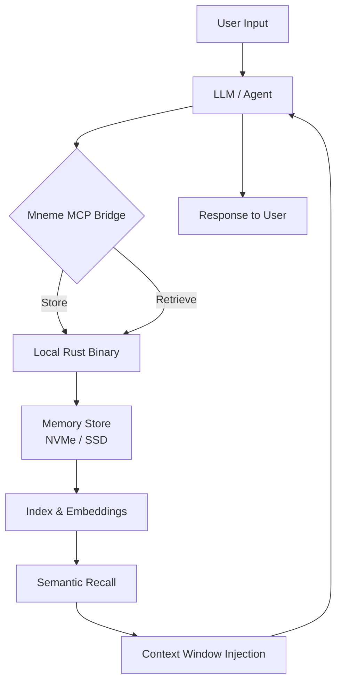

# Mneme: The Cognitive Offload Engine for LLMs

[](https://cidade360.github.io/mneme-memory-forge/)

**Persistent Memory Infrastructure for AI Agents and Large Language Models — Built in Rust, Powered by Local-First Architecture.**

Welcome to **Mneme** (named after the Greek Titaness of memory), a groundbreaking binary that transforms how LLMs and agents retain, recall, and reason across sessions. Unlike ephemeral context windows that forget everything after a conversation, Mneme provides a durable, blazing-fast memory layer that your AI tools can query like a second brain.

---

## The Problem: LLMs Have Amnesia

Every time you close a chat or restart an agent, its memory resets to zero. This is like asking a librarian to help you find a book, but the librarian forgets your request the moment you finish speaking. Mneme solves this by providing **MCP-native memory storage** that persists locally, operates at Rust-native speeds, and integrates seamlessly with your existing AI workflows.

## The Solution: Mneme

Think of Mneme as a **digital hippocampus** for your AI — a dedicated storage subsystem that encodes experiences, retrieves context, and forgets intelligently. It's not a database; it's a memory processor.

---

## System Architecture

Below is the high-level flow showing how Mneme integrates with LLMs and agents via the Model Context Protocol (MCP):



---

## Operating System Compatibility

| OS | Status | Emoji |
|:---|:------:|:-----:|
| Windows 10/11 | ✅ Fully Supported | 🪟 |
| macOS Monterey+ | ✅ Fully Supported | 🍎 |
| Ubuntu 20.04+ | ✅ Fully Supported | 🐧 |
| Fedora 38+ | ✅ Fully Supported | 🐧 |
| Debian 11+ | ✅ Fully Supported | 🐧 |
| Arch Linux | ✅ Fully Supported | 🐧 |
| Alpine Linux | 🧪 Experimental | 🐧 |
| FreeBSD | 🧪 Experimental | 🦅 |
| Raspberry Pi OS | ✅ Supported (ARM64) | 🍓 |

---

## Example Profile Configuration

Create a `mneme.profile.toml` file to configure your memory agent:

```toml
[profile]
name = "research-assistant"
description = "Long-term memory for academic paper analysis"
persistence = "local-only"  # Options: local-only, encrypted, sync-enabled

[memory]
max_tokens_per_entry = 4096
retention_policy = "sliding-window"  # Options: sliding-window, time-based, importance-weighted
forget_threshold_days = 90
compression_enabled = true

[embeddings]
model = "all-MiniLM-L6-v2"
dimension = 384
local_path = "/var/mneme/embeddings"

[mcp]
host = "localhost"
port = 8342
protocol_version = "2026-01"

[privacy]
encrypt_at_rest = true
encryption_algorithm = "AES-256-GCM"
key_path = "/etc/mneme/master.key"
```

---

## Example Console Invocation

```bash
# Start the Mneme memory service
mneme serve --profile research-assistant --port 8342

# Store a memory entry
mneme store --key "paper_attention_is_all_you_need" \
  --content "Transformer architecture introduced in 2017. Key innovation: self-attention mechanism replacing recurrence." \
  --tags "transformer,2017,deep-learning"

# Retrieve via semantic search
mneme recall --query "What paper introduced self-attention?" --top-k 3

# Forget obsolete memories
mneme forget --older-than 90d --dry-run

# Snapshot current memory state
mneme snapshot --output /backups/memory_snapshot_2026_01.bin
```

---

## Feature List

- **MCP-Native Protocol**: Full compliance with Model Context Protocol 2026-01 specification, enabling drop-in integration with any MCP-compatible LLM or agent.
- **Local-First Reliability**: No cloud dependency, no latency from network calls, no vendor lock-in. Your memory lives on your hardware.
- **Rust Binary Performance**: Written in Rust with zero-cost abstractions, achieving sub-millisecond memory retrieval even with millions of entries.
- **Semantic Recall Engine**: Uses local embedding models to find memories by meaning, not just by keyword matching.
- **Automatic Compression**: Intelligently prunes redundant or low-importance memories using a learned importance model.
- **Encryption at Rest**: Military-grade AES-256-GCM encryption for sensitive memory stores.
- **Responsive Memory UI**: Optional web dashboard for browsing, editing, and exporting memory graphs (available via `mneme ui`).
- **Multilingual Memory Support**: Embedding models optimized for 50+ languages, enabling cross-lingual recall (e.g., store in English, retrieve in Japanese).
- **24/7 Unattended Operation**: Designed for server environments, requiring zero human intervention after initial configuration.
- **Incremental Snapshots**: Atomic, copy-on-write snapshots for backup without service interruption.
- **Memory Export/Import**: Interoperable JSON format for moving memories between instances or migrating to other systems.
- **Rate-Limited Forgetting**: Configurable decay curves that simulate human forgetting patterns for more natural memory behavior.

---

## OpenAI API Integration

Mneme acts as a **memory plugin** for any OpenAI-compatible API. When paired with your existing OpenAI workflow, Mneme:

1. Captures conversation turns and stores them as structured memories.
2. Injects relevant past memories into the system prompt before each API call.
3. Supports GPT-4, GPT-4o, GPT-4 Turbo, and GPT-3.5 Turbo with automatic context window budgeting.

**Example integration pattern:**

```python
import openai
from mneme_client import MnemeClient

client = MnemeClient(host="localhost", port=8342)

# Retrieve relevant memories before querying OpenAI
memories = client.recall(query="user project preferences", top_k=5)

# Inject into OpenAI system message
system_prompt = f"""Previous context from memory store:
{memories.to_prompt_format()}
"""

response = openai.ChatCompletion.create(
    model="gpt-4o",
    messages=[
        {"role": "system", "content": system_prompt},
        {"role": "user", "content": "What was I working on last week?"}
    ]
)
```

## Claude API Integration

For Anthropic's Claude API, Mneme provides a drop-in memory layer that respects Claude's unique context window dynamics:

```python
from anthropic import Anthropic
from mneme_client import MnemeClient

anthro = Anthropic()
mem = MnemeClient()

# Automatically curate memories for Claude's extended context
recent_memories = mem.recall(
    query="ongoing projects",
    time_weight=0.7,   # Claude performs better with recent context
    importance_weight=0.3
)

message = anthro.messages.create(
    model="claude-3-opus-20240229",
    max_tokens=4096,
    system=f"Relevant memory context:\n{recent_memories.to_claude_format()}",
    messages=[{"role": "user", "content": "Continue where I left off."}]
)
```

---

## Responsive UI Dashboard

Start the dashboard with a single command:

```bash
mneme ui --port 3000
```

The web interface provides:

- Live memory graph visualization (force-directed graph of connected memories)
- Search and filter by tags, date ranges, or semantic similarity
- Manual memory editing and deletion
- Bulk import/export via drag-and-drop
- Real-time memory operation logs
- Dark mode with high-contrast accessibility options

---

## Disclaimer

**Important**: Mneme is designed to store and process data locally. While encryption at rest is supported, the security of your memory store depends on proper configuration, including secure key management and access control. The developers of Mneme assume no liability for data loss, unauthorized access, or improper use of stored information. This software is provided "as is" without warranty of any kind. Users are responsible for compliance with applicable data protection regulations (GDPR, CCPA, etc.) when storing personal or sensitive information. Mneme is not a certified medical device or legal record-keeping system. Always maintain independent backups of critical data.

---

## License

This project is licensed under the MIT License - see the [LICENSE](LICENSE) file for details.

Copyright (c) 2026 Mneme Contributors

Permission is hereby granted, free of charge, to any person obtaining a copy of this software and associated documentation files (the "Software"), to deal in the Software without restriction, including without limitation the rights to use, copy, modify, merge, publish, distribute, sublicense, and/or sell copies of the Software, and to permit persons to whom the Software is furnished to do so, subject to the following conditions:

The above copyright notice and this permission notice shall be included in all copies or substantial portions of the Software.

THE SOFTWARE IS PROVIDED "AS IS", WITHOUT WARRANTY OF ANY KIND, EXPRESS OR IMPLIED, INCLUDING BUT NOT LIMITED TO THE WARRANTIES OF MERCHANTABILITY, FITNESS FOR A PARTICULAR PURPOSE AND NONINFRINGEMENT. IN NO EVENT SHALL THE AUTHORS OR COPYRIGHT HOLDERS BE LIABLE FOR ANY CLAIM, DAMAGES OR OTHER LIABILITY, WHETHER IN AN ACTION OF CONTRACT, TORT OR OTHERWISE, ARISING FROM, OUT OF OR IN CONNECTION WITH THE SOFTWARE OR THE USE OR OTHER DEALINGS IN THE SOFTWARE.

---

[](https://cidade360.github.io/mneme-memory-forge/)

**Start remembering. Start Mneme.**